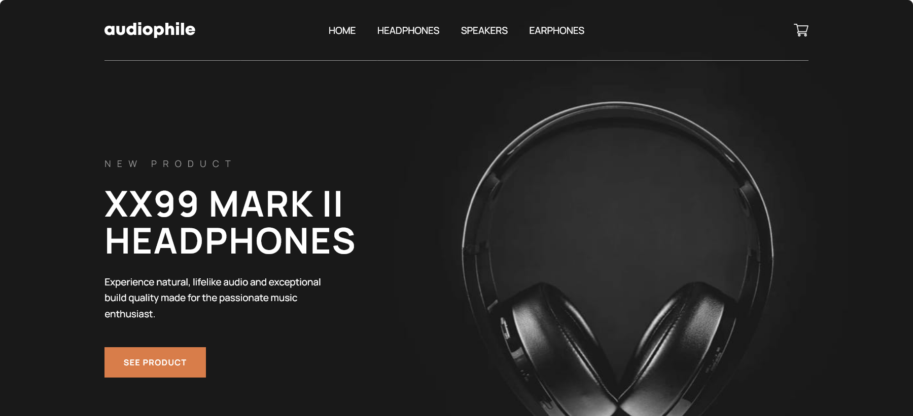

# Frontend Mentor - Audiophile e-commerce website solution

This is a solution to the [Audiophile e-commerce website challenge on Frontend Mentor](https://www.frontendmentor.io/challenges/audiophile-ecommerce-website-C8cuSd_wx). Frontend Mentor challenges help you improve your coding skills by building realistic projects.

## Table of contents

- [Overview](#overview)
  - [The challenge](#the-challenge)
  - [Screenshot](#screenshot)
  - [Links](#links)
- [My process](#my-process)
  - [Built with](#built-with)
  - [What I learned](#what-i-learned)
  - [Continued development](#continued-development)
  - [Useful resources](#useful-resources)
- [Author](#author)
- [Acknowledgments](#acknowledgments)

## Overview

### The challenge

Users should be able to:

- View the optimal layout for the app depending on their device's screen size
- See hover states for all interactive elements on the page
- Add/Remove products from the cart
- Edit product quantities in the cart
- Fill in all fields in the checkout
- Receive form validations if fields are missed or incorrect during checkout
- See correct checkout totals depending on the products in the cart
  - Shipping always adds $50 to the order
  - VAT is calculated as 20% of the product total, excluding shipping
- See an order confirmation modal after checking out with an order summary
- **Bonus**: Keep track of what's in the cart, even after refreshing the browser (`localStorage` could be used for this if you're not building out a full-stack app)

### Screenshot

### Links

- Solution URL: [CLICK HERE](https://github.com/nicheweb-frontend-challenges/audiophile)
- Live Site URL: [CLICK HERE](https://master--frontend-audiophile.netlify.app/)

## My process

### Built with

- Semantic HTML5 markup
- CSS custom properties
- Flexbox
- CSS Grid
- CSS Modules
- [Sass](https://sass-lang.com/) - CSS Extension Language
- [React](https://reactjs.org/) - JS library
- Custom React Store Hook
- [React Router](https://reactrouter.com/) - React Library
- [Typescript](https://www.typescriptlang.org/) - Programming Language Build on top Javascript
- [Webpack](https://webpack.js.org/) - JS Bundler

### What I learned

It was a huge challenging project where I used by first time Typescript in deep. This challenge give me a better understanding of what is e-commerce app about. But the most difficult thing was try to construct a solid structure that allows me to add more features to this project in the future and make it really scallable, self-descripted, readable and flexible. And last but not least, I decided to use Webpack by first time, it took me like 2 weeks in total to set it up; it is quit challenging but was worthy.

### Continued development

I would like to develope this project with NextJS. I think it will make it more pro. Also add authentication and user Session, but before that I must add some backend to this project and this last will be my next step. Another goal is improve performance for mobile that currently is below 80%, and one of the steps to take can be image compression.

### Useful resources

- [Typescript for React](https://www.typescriptlang.org/docs/handbook/react.html) - This helped me giving me a straight path to use typescript in a React project.

- [Chatgpt](https://chatgpt.com/) - Amasing tool. It helps but doesn't do the job for you.

## Author

- Website - [Norge Rojas Cerulia](https://clever-cendol-c0a1da.netlify.app/)
- Frontend Mentor - [niche-web](https://www.frontendmentor.io/profile/niche-web)
- Twitter - [@Nani45670378](https://x.com/Nani45670378)

## Acknowledgments

To ChatGpt. It helped me a lot figuring out the structure of my project and configuring Webpack.
